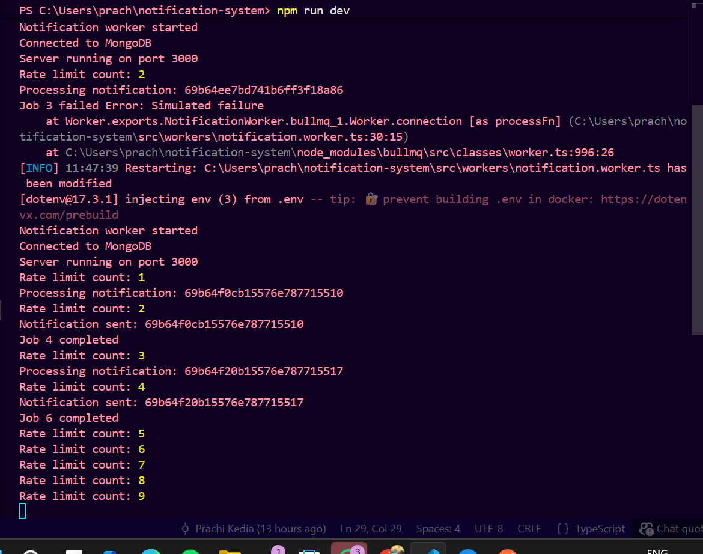
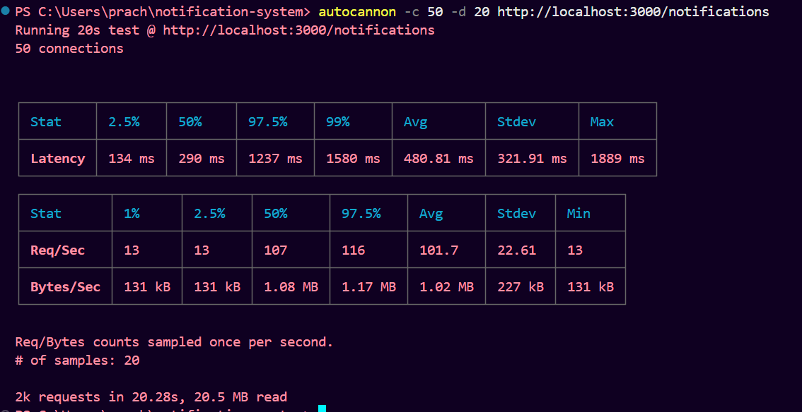
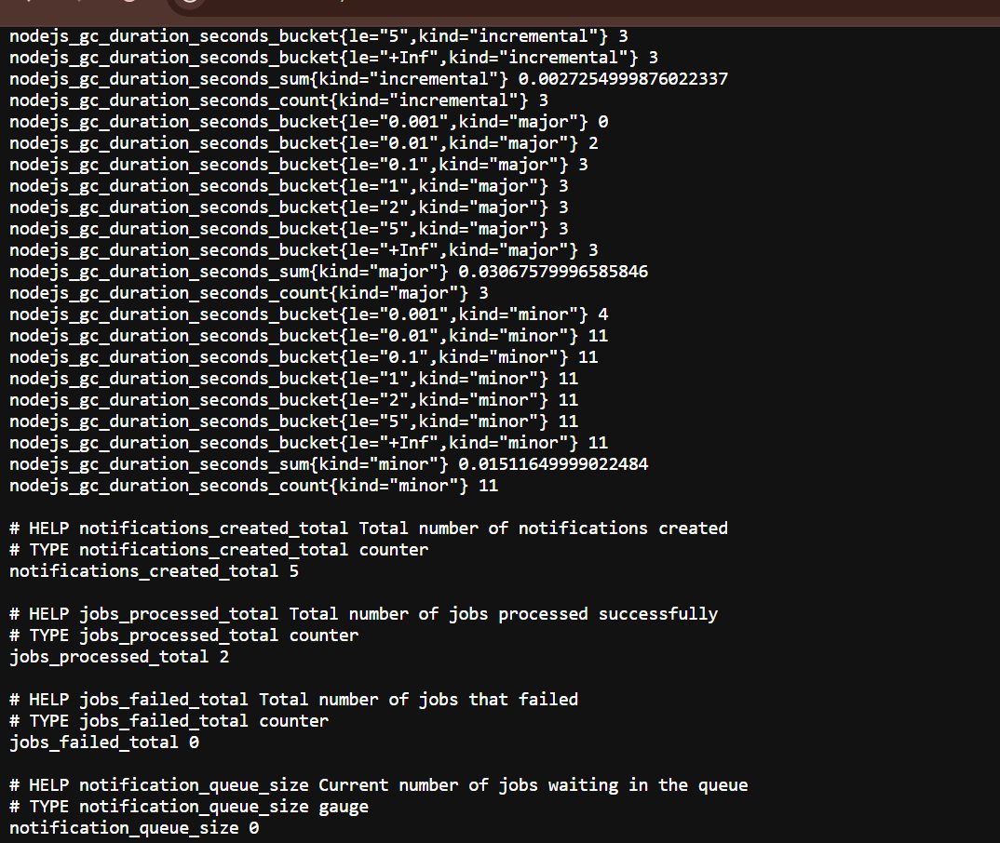

# Notification System API

A backend system built to explore production patterns like async job queues, retry logic, rate limiting, and observability. Built while learning backend engineering — the goal was to go beyond basic CRUD and understand how real systems handle scale and failure.

---

## What It Does

Clients send notification requests to the API. Each request is validated, stored in MongoDB, and pushed to a Redis queue. A background worker picks up the job, processes it asynchronously, and tracks the result. If a job fails, it retries with exponential backoff. All of this is monitored via Prometheus metrics and a Grafana dashboard.

---

## Tech Stack

- **Node.js + Fastify** — lightweight, fast HTTP framework
- **MongoDB** — stores notifications persistently
- **Redis + BullMQ** — job queue for async processing
- **Prometheus** — metrics collection
- **Grafana** — metrics visualization
- **Docker** — runs the infrastructure stack locally

---

## LIVE DEMO
```
**Base URL**
https://notification-system-api-ia9d.onrender.com
**Metrics Endpoint**
https://notification-system-api-ia9d.onrender.com/metrics
```

---

## Architecture

```
Client Request
     ↓
Fastify API (input validation)
     ↓
Redis Rate Limiter (abuse prevention)
     ↓
MongoDB (persist notification)
     ↓
BullMQ Queue (async job dispatch)
     ↓
Worker (processes job)
  ├── Success → mark complete, increment counter
  └── Failure → retry with exponential backoff
     ↓
Prometheus Metrics → Grafana Dashboard
```

---

## Key Features

**Async Processing** — notifications are processed in the background via BullMQ workers, so the API returns instantly without blocking on the actual processing work.

**Retry with Exponential Backoff** — if a job fails, BullMQ retries it with increasing delays. This handles transient failures gracefully without hammering the system.

**Rate Limiting** — Redis-based rate limiter sits in front of the API to prevent abuse and protect downstream services.

**Prometheus Metrics** — custom metrics are exported at `/metrics` and scraped by Prometheus. Four metrics are tracked: `notifications_created_total`, `jobs_processed_total`, `jobs_failed_total`, and `notification_queue_size`.

**Observability** — Grafana dashboard visualizes system health. The metrics endpoint is queryable in real time.

---

## API Endpoints

| Method | Endpoint | Description |
|--------|----------|-------------|
| POST | `/notifications` | Create a new notification |
| GET | `/notifications` | List all notifications |
| GET | `/notifications/:id` | Get a notification by ID |
| DELETE | `/notifications/:id` | Delete a notification |
| GET | `/metrics` | Prometheus metrics |

---

## Running Locally

```bash
# Install dependencies
npm install

# Start the API + worker
npm run dev

# Start Prometheus + Grafana (Docker required)
docker compose up -d
```

---

## Screenshots

### Worker Logs — Processing, Failures, and Rate Limiting


Shows the worker handling jobs in real time. Job 3 intentionally fails (simulated failure) to verify retry behavior works correctly. Rate limit counts increment as expected.

### Load Test Results (autocannon — 50 connections, 20s)


50 concurrent connections over 20 seconds. ~2,000 total requests processed. Median latency: 290ms, average throughput: ~101 req/sec. The high p99 latency (1580ms) is expected — rate limiting kicks in under load and queues requests.

### Prometheus Metrics Output


Custom metrics are exported correctly: 5 notifications created, 2 jobs processed, 0 failed, queue size at 0. Standard Node.js runtime metrics (GC, heap, event loop) are also included automatically via `prom-client`.

---

Still learning — open to feedback on the architecture and any improvements.

---

